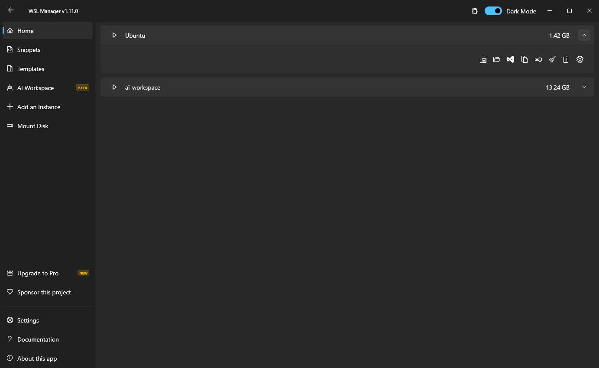
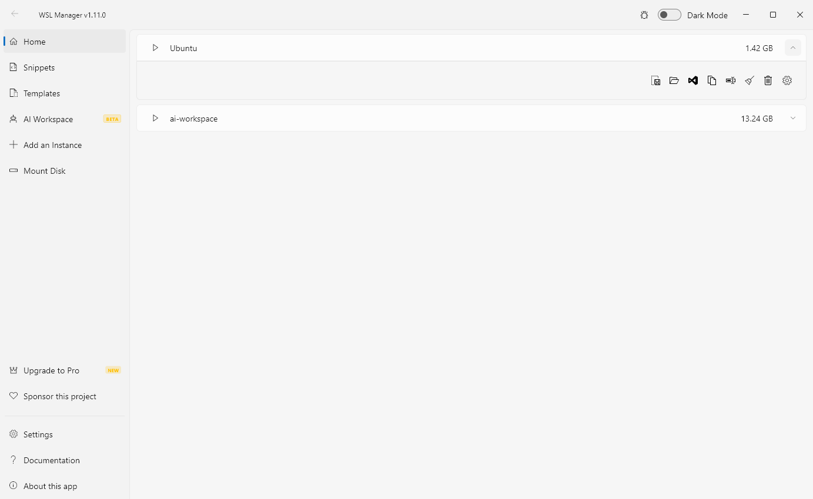
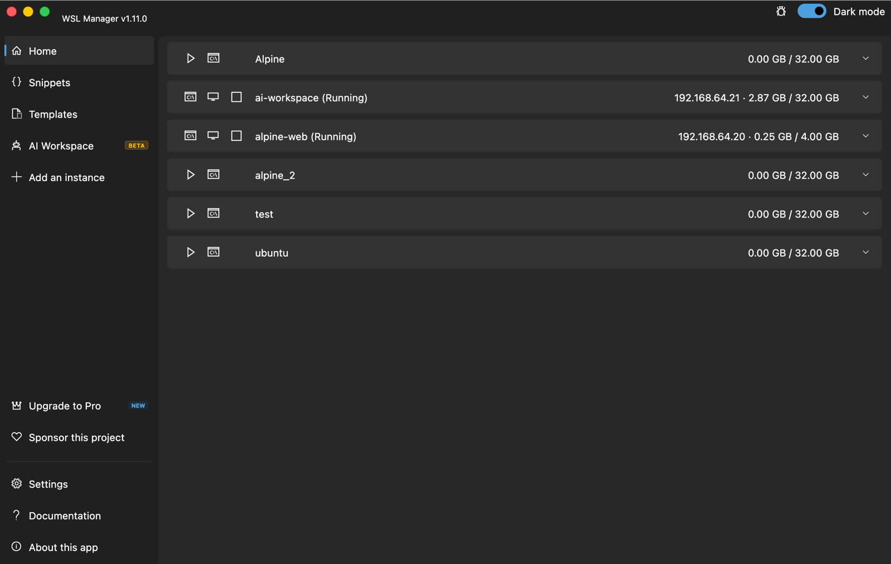
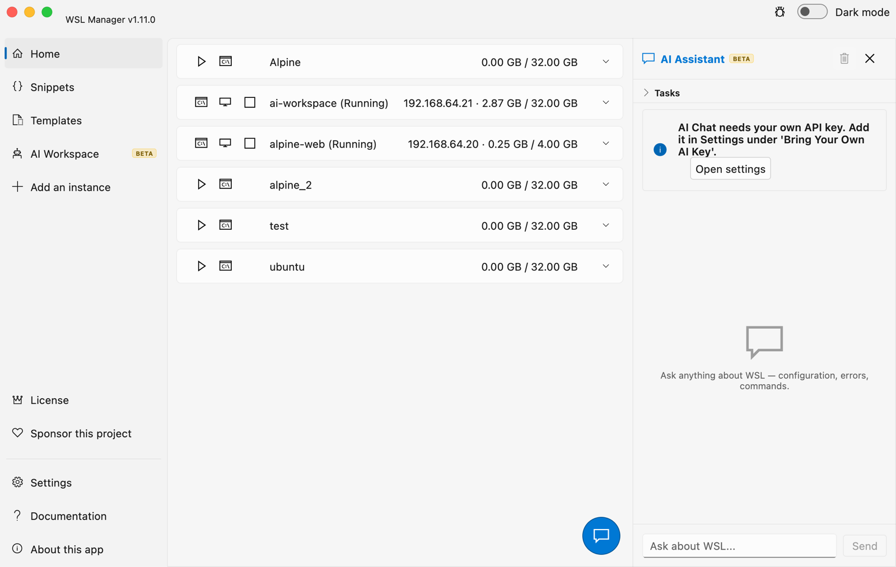

<h1 align="center">Welcome to WSL Manager 👋</h1>


[](https://github.com/bostrot/wsl2-distro-manager/wiki)
[](https://gitlab.com/bostrot/wsl2-distro-manager)
[](https://discord.gg/fY5uE5WRTP)


<p align='center'>
    English | <a href='./readme/README_zh.md'>简体中文</a> | <a href='./readme/README_zh_tw.md'>繁體中文</a> | <a href='./readme/README_de.md'>Deutsch</a> | <a href='./readme/README_es.md'>Español</a> | <a href='./readme/README_ja.md'>日本語</a> | <a href='./readme/README_hu.md'>Magyar</a> | <a href='./readme/README_pt.md'>Português</a> | <a href='./readme/README_tr.md'>Türkçe</a>
</p>



<p align='center'>
    <sub>Shown on <b>Windows</b> &middot; the same app runs native VMs on <b>macOS</b> &mdash; expand <b>See it on macOS</b> below</sub>
</p>

<details>
<summary>Preview with light theme (Windows)</summary>



</details>

<details>
<summary><b>🍎 See it on macOS</b> &mdash; native Linux and macOS virtual machines through Apple's Virtualization framework <i>(beta)</i></summary>





</details>

> **WSL Distro Manager** is a free, open source GUI for the Windows Subsystem
> for Linux — and, on macOS, for native Linux VMs. Install, copy, rename,
> move, back up and delete WSL distros without memorising a single `wsl.exe`
> flag — plus templates, saved command snippets, disk mounting, `.wslconfig`
> editing, remote WSL over SSH, and an MCP server that lets AI agents drive
> your WSL environment. On a Mac the very same app manages virtual machines
> through Apple's Virtualization framework instead.

## 🚀 Features

**Manage distros**
- [x] Install from a built-in catalogue, or bring your own rootfs
- [x] Copy, rename, move to another drive, back up and delete instances
- [x] Compact virtual disks to reclaim space WSL never gives back
- [x] Supports Ubuntu, Debian, Alpine, Kali Linux, openSUSE, SLES and anything else WSL accepts

**Get instances running faster**
- [x] Use any Docker image as a distro — Docker itself is not required
- [x] Package a configured distro as a portable `.wsl` file that installs on any machine (templates are deprecated in favour of these)
- [x] Turnkey Linux and other LXC containers (experimental)
- [x] Snippets: keep your setup commands in the app and run them on any instance
- [x] Point the app at your own repository of rootfs images

**Configure without editing files by hand**
- [x] systemd, automount, default user, start command and start path per distro
- [x] Memory, processors, swap, networking mode, DNS and the rest of `.wslconfig`
- [x] Mount a physical disk or a VHD into WSL, with partition and filesystem control

**Work the way you already do**
- [x] Open Windows Terminal, VS Code or Explorer straight inside a distro
- [x] Manage WSL on a *different* Windows machine over SSH
- [x] Sync a distro between two machines on your network
- [x] Dark and light themes, available in nine languages

**On macOS: native virtual machines** *(beta)*
- [x] The same app manages VMs through Apple's Virtualization framework instead of WSL
- [x] Create Linux VMs from an installer ISO, a cloud image or an exported template
- [x] Create macOS guest VMs from a restore image (Apple Silicon)
- [x] Start, stop, clone, export/import and template VMs like distros
- [x] Run commands inside VMs over auto-provisioned SSH (cloud-init), from the GUI, the AI chat or MCP clients
- [x] Build with `scripts/build_macos.sh` — bundles the signed `vmctl` helper

**Pro** *(optional one-time purchase on the Microsoft Store — not a subscription)*
- [x] **AI Workspace** — run Hermes Agent, OpenClaw and Open WebUI in a dedicated, isolated WSL distro
- [x] **AI assistant with tools** — the built-in chat can actually *operate* your WSL: it lists and inspects distros, runs commands, edits config, creates snippets, mounts disks and packages distros through the same tools the MCP server exposes
- [x] **Sandboxed AI** — spin up a throwaway Ubuntu distro and give an AI chat access to *only* the inside of that sandbox
- [x] **Task queue** — hand the assistant a checklist and let it work through it, ticking items off as it goes
- [x] **MCP server** — expose WSL to Claude Desktop, Claude Code, opencode and other MCP clients
- [x] **Web dashboard** — manage everything from your phone or another computer: scan a QR code, get the whole app in a browser, optionally published beyond your network through a Cloudflare tunnel

> The AI features run on credentials **you** bring — your own OpenAI-compatible
> API key, or your **Claude subscription** (Sign in with Claude). No AI service
> is hosted or included, there is no quota, and no requests pass through anyone
> else's servers. Pro unlocks the features in the app; it does not buy AI
> credits. See [Free vs Pro](https://github.com/bostrot/wsl2-distro-manager/wiki/Pro-Version).

## 🤖 AI assistant & MCP

The AI assistant is an **agent**, not just a chat box: it is given the same tool
set the MCP server exposes, so when you ask "what distros do I have?" or "install
Ubuntu and set my default user" it calls real tools against your WSL rather than
guessing. Tool calls are shown inline as it works.

**Pick a provider** in **Settings → Bring Your Own AI Key**:

- **Own API key** — any OpenAI-compatible endpoint (OpenAI, Azure, a LiteLLM
  proxy, Ollama, LM Studio, …). Enter the base URL, key and model. The **Load
  model list** button fills an autocomplete from the provider's `/models`, and
  **Test connection** proves the credentials work before you open the chat.
- **Claude subscription** — *Sign in with Claude* (OAuth): the chat then runs on
  your Claude plan through the Messages API. No API key to paste.

**Sandboxes** (AI Workspace → *Add sandbox distro*) create a throwaway distro
from any catalog image (newest Ubuntu by default). Its chat is handed only the
`sandbox_*` tools, which are locked to that one distro — the model can run
anything *inside* the sandbox and can never see your Windows host or any other
distro. One honest caveat: the sandbox distro itself has normal outbound
internet access, like any WSL distro. Sandbox chats use the same docked panel
as the assistant (task queue included), their transcripts persist, and the
history button in the chat header switches between the assistant and any
sandbox session.

**Task queue** — open the *Tasks* section at the top of the chat, add items, and
press ▶. The assistant works through them with its tools and checks each off as
it finishes; you can keep adding tasks while it runs.

### Connecting external AI clients (MCP)

Turn on **Settings → MCP Server** (Pro). It serves the MCP protocol at
`http://127.0.0.1:59133/mcp`, loopback-only, guarded by a bearer token shown in
the same panel. The tools cover the full lifecycle — create, import, configure,
run, package and (with a confirm flag) unregister distros, plus snippets, disk
mounting and persistent terminal sessions.

**Claude Desktop** — click **Connect Claude Desktop** in the MCP panel. It writes
the entry below into `claude_desktop_config.json` for you (needs Node.js);
restart Claude Desktop afterwards. To do it by hand, or for any other stdio MCP
client, bridge the HTTP endpoint with [`mcp-remote`](https://www.npmjs.com/package/mcp-remote):

```jsonc
// claude_desktop_config.json  (%APPDATA%\Claude\)
{
  "mcpServers": {
    "wsl-manager": {
      "command": "npx",
      "args": [
        "-y", "mcp-remote",
        "http://127.0.0.1:59133/mcp",
        "--header", "Authorization:${AUTH_HEADER}"
      ],
      "env": { "AUTH_HEADER": "Bearer <TOKEN FROM THE MCP PANEL>" }
    }
  }
}
```

**Claude Code** — same bridge, one command:

```bash
claude mcp add wsl-manager -- npx -y mcp-remote http://127.0.0.1:59133/mcp \
  --header "Authorization: Bearer <TOKEN>"
```

**opencode** — add it under `mcp` in your `opencode.json` (or `~/.config/opencode/opencode.json`):

```jsonc
{
  "mcp": {
    "wsl-manager": {
      "type": "local",
      "command": ["npx", "-y", "mcp-remote", "http://127.0.0.1:59133/mcp",
                  "--header", "Authorization: Bearer <TOKEN>"]
    }
  }
}
```

Any MCP client that speaks streamable HTTP can also point straight at the
endpoint with an `Authorization: Bearer <TOKEN>` header, skipping `mcp-remote`.
To reach it from another machine, enable the built-in **Cloudflare tunnel**
toggle in the same panel and use the public URL it prints.

## 📱 Web dashboard

Turn on **Settings → Web Dashboard** (Pro) and the app serves a browser
dashboard on port `59134` for every device on your network — Windows and macOS
alike. Scan the QR code the panel shows with your phone (or copy the link) and
you get the whole app in a browser: start, stop, duplicate and delete instances,
run commands, open persistent terminal sessions, run your saved snippets, and
drive every other tool (import, export, packaging, `.wslconfig`, disks, VM
creation) through generated forms. It is the same tool set the AI assistant
and the MCP server use.

Access is guarded by a token that is part of the link (`?token=…`), so a
scanned QR code is all a device needs — and regenerating the token in the
panel revokes every link handed out so far. The dashboard binds to all
interfaces on purpose; flip **Publish via Cloudflare Tunnel** in the same panel
to get a temporary public HTTPS link (the QR code switches to it) when you need
it away from home. Once published, the token is the only thing protecting a
surface that can run commands, so share that link with care.

## 📦 Install

<details>
<summary>Microsoft Store</summary>

This app is available on the [Microsoft Store](https://apps.microsoft.com/store/detail/wsl-manager/9NWS9K95NMJB?hl=en-us&gl=US).
</details>

<details>
<summary>Direct download</summary>

You can get this app with a direct download from the [Releases](https://github.com/bostrot/wsl2-distro-manager/releases) page. The latest version is available as a zip file.
</details>

<details>
<summary>Install via Winget</summary>

```sh
winget install Bostrot.WSLManager
```

</details>

<details>
<summary>Install via Scoop</summary>

```sh
scoop install extras/wsl2-distro-manager
```

</details>

<details>
<summary>Install via Chocolatey</summary>

This package is maintained by the community ([@mikeee](https://github.com/mikeee/ChocoPackages)). It is not an official package.

```sh
choco install wsl2-distro-manager
```

</details>

<details>
<summary>Install a nightly build</summary>

The latest nightly build is available as an artifact in the "releaser" workflow or via [this link](https://nightly.link/bostrot/wsl2-distro-manager/workflows/releaser/main/wsl2-distro-manager-nightly-archive.zip).

</details>

## ⚙️ Build

Make sure [flutter](https://flutter.dev/desktop) is installed:

```powershell
flutter config --enable-windows-desktop
flutter upgrade

flutter build windows # build it
flutter run -d windows # run it
```

## Author

👤 **Eric Trenkel**

- Website: [erictrenkel.com](https://erictrenkel.com)
- GitHub: [@bostrot](https://github.com/bostrot)
- LinkedIn: [@erictrenkel](https://linkedin.com/in/erictrenkel)

👥 **Contributors**

[](https://github.com/bostrot/wsl2-distro-manager/graphs/contributors)

## 🤝 Contributing

Contributions, issues and feature requests are welcome!\
Feel free to check the [issues page](https://github.com/bostrot/wsl2-distro-manager/issues).
You can also take a look at the [contributing guide](https://github.com/bostrot/wsl2-distro-manager/blob/main/CONTRIBUTING.md).

## Show your support

Give a ⭐️ if this project helped you!

## 📝 License

Copyright © 2026 [Eric Trenkel](https://github.com/bostrot).\
This project is [GPL-3.0](https://github.com/bostrot/wsl2-distro-manager/blob/main/LICENSE) licensed.

---

_Not found what you were looking for? Check out the [Wiki](https://github.com/bostrot/wsl2-distro-manager/wiki)_
